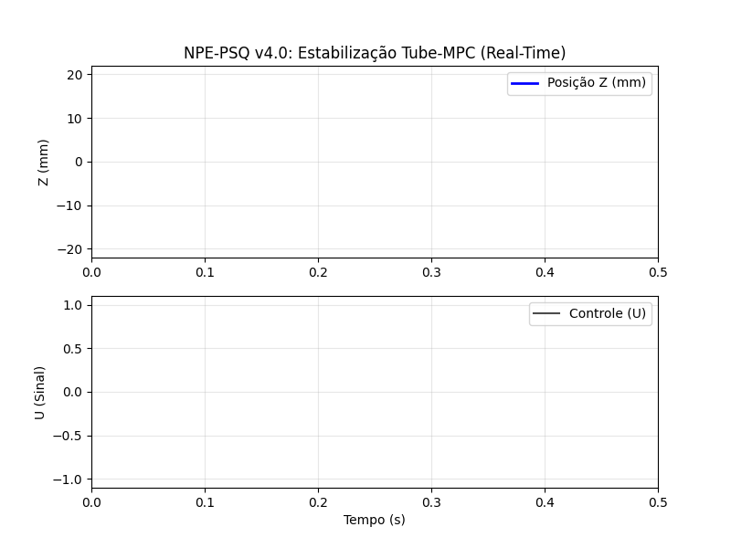

# ⚛️ NPE-PSQ-2D: Tokamak Physics Engine v4.0

## 🎯 Sobre o Projeto
O **NPE-PSQ** é um simulador de alta fidelidade para dinâmica vertical de plasma, focado em **VDE (Vertical Displacement Events)**.

## 🚀 Especificações
* **Controlador:** Tube-based MPC (NMPC + LQR).
* **Integrador:** Runge-Kutta 4.
* **Física:** Ruído de Wiener e dinâmica não-linear.

## 📄 Documentação
Veja os detalhes matemáticos em [`paper.md`](paper.md).
