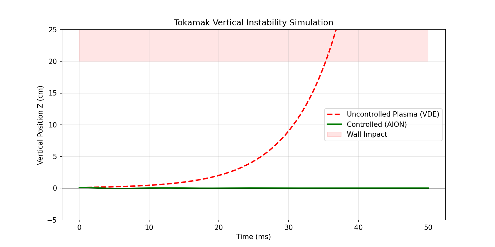

<div align="center">
  
  <br><br>

  []()
  []()
  []()
</div>

---

# ⚡ NPE-PSQ-2D: Tokamak Physics Engine

> **Lightweight vertical instability simulator for Hardware-in-the-Loop testing**
> *Developed by a 17-year-old researcher | 2025*

## 🎯 What is this?

**NPE-PSQ (Nuclear Plasma Engineering - Plasma Simulator)** is a specialized 2D physics engine designed to simulate the **Vertical Displacement Event (VDE)** in elongated tokamak plasmas.

It serves as the chaos generator to test the **[AION-CORE](https://github.com/Akirabrs/AION-CORE)** control framework.

---

## ⚛️ The Physics (Why it crashes)

Tokamaks with elongated cross-sections ($k > 1$) are inherently vertically unstable. Without active control, any small perturbation grows exponentially due to the negative decay index of the magnetic field.

**Dynamics Equation:**
$$ \ddot{z} = \gamma^2 z + \frac{F_{act}}{m} + w_{noise} $$

Where $\gamma$ is the instability growth rate (typically $10^3 s^{-1}$ for high-performance reactors).



---

## 🕹️ Usage (OpenAI Gym Style)

Designed to be easy for Reinforcement Learning or Classical Control testing.

```python
from npe.plant import TokamakPlant

# Initialize Reactor (Instability Factor 10.0)
env = TokamakPlant(gamma=10.0)

# Simulation Loop
state = env.reset()
for t in range(100):
    # Your Controller Here (e.g., AION)
    u = -50.0 * state[0]
    
    # Step Physics
    next_state, crashed = env.step(u)
    
    if crashed:
        print("💥 SCRAM: Plasma hit the wall!")
        break
```

---

## 🔗 Integration

This engine is the dedicated testing ground for:
👉 **[AION-CORE: Adaptive Robust Control Framework](https://github.com/Akirabrs/AION-CORE)**

---

## 👤 Author

**Guilherme Brasil (Akira)**
*Fusion Energy Enthusiast & Developer*

---